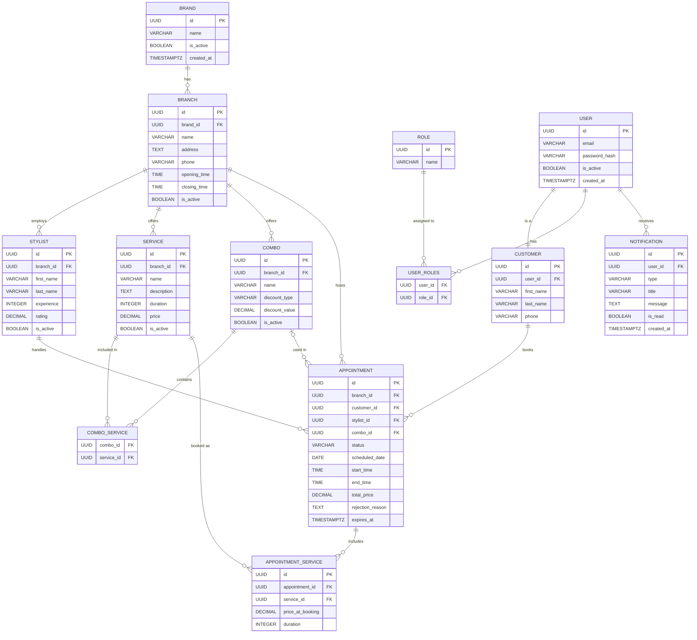
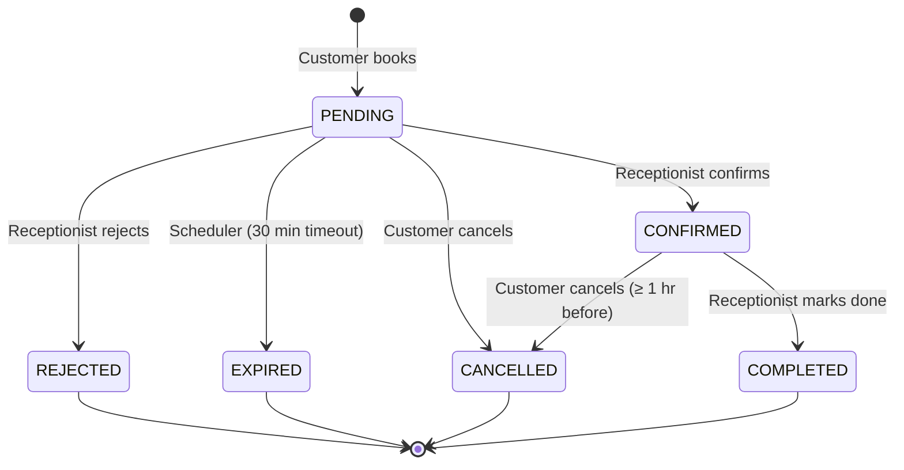
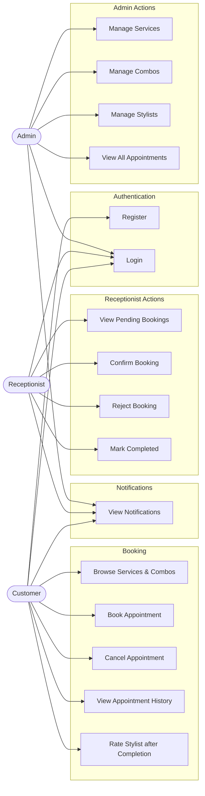
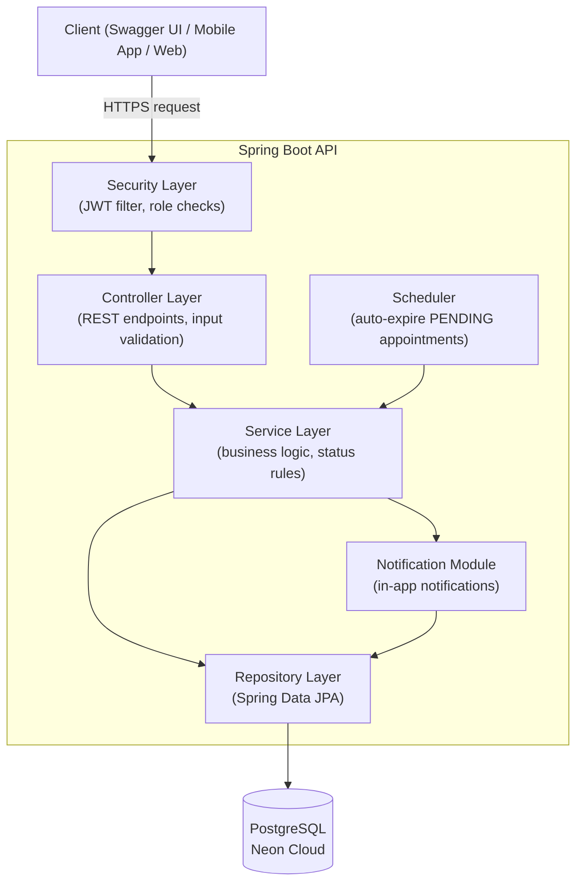

# GlowDesk — UML Diagrams

---

## 1. Entity Relationship Diagram (Database)

---

## 2. Appointment Status Flow (State Diagram)

---

## 3. Use Case Diagram

---

## 4. Layered Architecture Diagram

